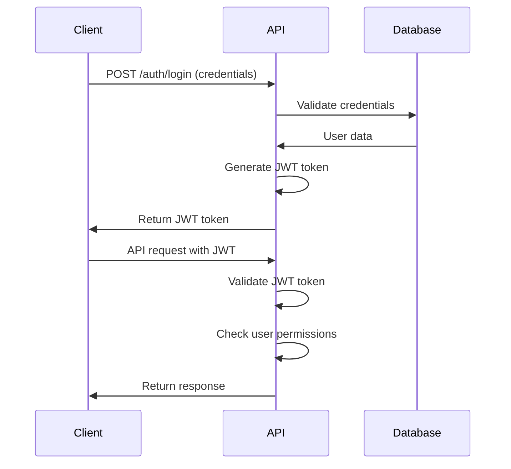

# Backend Architecture

### Service Architecture

#### Controller Organization
```
api/
├── views/
│   ├── runs.py            # Run management endpoints
│   ├── surveys.py         # Survey processing endpoints
│   ├── files.py           # File upload endpoints
│   └── reports.py         # Report generation endpoints
├── serializers/
│   ├── run_serializers.py
│   ├── survey_serializers.py
│   └── file_serializers.py
├── services/
│   ├── survey_calculator.py
│   ├── file_processor.py
│   └── report_generator.py
├── models/
│   ├── run.py
│   ├── survey.py
│   └── file.py
└── utils/
    ├── validators.py
    └── helpers.py
```

#### Controller Template
```python
from rest_framework import status
from rest_framework.decorators import api_view, permission_classes
from rest_framework.permissions import IsAuthenticated
from rest_framework.response import Response
from .serializers import RunSerializer
from .services import RunService

@api_view(['GET', 'POST'])
@permission_classes([IsAuthenticated])
def runs_view(request):
    if request.method == 'GET':
        runs = RunService.get_user_runs(request.user)
        serializer = RunSerializer(runs, many=True)
        return Response(serializer.data)
    
    elif request.method == 'POST':
        serializer = RunSerializer(data=request.data)
        if serializer.is_valid():
            run = RunService.create_run(serializer.validated_data, request.user)
            return Response(RunSerializer(run).data, status=status.HTTP_201_CREATED)
        return Response(serializer.errors, status=status.HTTP_400_BAD_REQUEST)
```

### Database Architecture

#### Schema Design
```python
from django.db import models
from django.contrib.auth.models import User
import uuid

class Well(models.Model):
    id = models.UUIDField(primary_key=True, default=uuid.uuid4, editable=False)
    well_name = models.CharField(max_length=255, unique=True)
    well_type = models.CharField(max_length=50, choices=[
        ('Oil', 'Oil'),
        ('Gas', 'Gas'),
        ('Water', 'Water'),
        ('Other', 'Other'),
    ])
    created_at = models.DateTimeField(auto_now_add=True)
    updated_at = models.DateTimeField(auto_now=True)
    
    class Meta:
        db_table = 'wells'

class Run(models.Model):
    id = models.UUIDField(primary_key=True, default=uuid.uuid4, editable=False)
    run_number = models.CharField(max_length=100, unique=True)
    run_name = models.CharField(max_length=255, unique=True)
    run_type = models.CharField(max_length=50, choices=[
        ('GTL', 'GTL'),
        ('Gyro', 'Gyro'),
        ('MWD', 'MWD'),
        ('Unknown', 'Unknown'),
    ])
    well = models.ForeignKey(Well, on_delete=models.SET_NULL, null=True, blank=True)
    user = models.ForeignKey(User, on_delete=models.CASCADE)
    created_at = models.DateTimeField(auto_now_add=True)
    updated_at = models.DateTimeField(auto_now=True)
    
    class Meta:
        db_table = 'runs'
```

#### Data Access Layer
```python
from django.db import models
from typing import List, Optional
from .models import Run, SurveyFile

class RunRepository:
    @staticmethod
    def get_user_runs(user) -> List[Run]:
        return Run.objects.filter(user=user).select_related('well')
    
    @staticmethod
    def get_run_by_id(run_id: str, user) -> Optional[Run]:
        try:
            return Run.objects.get(id=run_id, user=user)
        except Run.DoesNotExist:
            return None
    
    @staticmethod
    def create_run(data: dict, user) -> Run:
        return Run.objects.create(user=user, **data)

class SurveyFileRepository:
    @staticmethod
    def get_run_files(run_id: str) -> List[SurveyFile]:
        return SurveyFile.objects.filter(run_id=run_id)
    
    @staticmethod
    def create_survey_file(data: dict) -> SurveyFile:
        return SurveyFile.objects.create(**data)
```

### Authentication and Authorization

#### Auth Flow


#### Middleware/Guards
```python
from rest_framework_simplejwt.authentication import JWTAuthentication
from rest_framework.permissions import BasePermission

class IsOwnerOrReadOnly(BasePermission):
    def has_object_permission(self, request, view, obj):
        if request.method in ['GET', 'HEAD', 'OPTIONS']:
            return True
        return obj.user == request.user

class SurveyPermission(BasePermission):
    def has_permission(self, request, view):
        if request.user.role in ['Admin', 'Engineer', 'Surveyor']:
            return True
        return False
```

