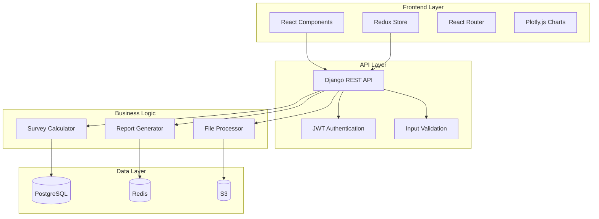

# Components

### Frontend Web Application
**Responsibility:** User interface for survey management, data visualization, and report generation

**Key Interfaces:**
- React Router for navigation and protected routes
- Redux store for state management and calculation status
- Axios HTTP client for API communication
- Plotly.js for 2D/3D survey visualization
- Material-UI components for consistent UI

**Dependencies:** Backend API, AWS S3 for file downloads, Plotly.js CDN

**Technology Stack:** React 18.2, TypeScript, Material-UI, Redux Toolkit, Vite

### Django API Server
**Responsibility:** Business logic, data processing, file handling, and API endpoints

**Key Interfaces:**
- Django REST Framework API endpoints
- Welleng library integration for survey calculations
- AWS S3 file operations and storage
- PostgreSQL database access via Django ORM
- JWT authentication and authorization

**Dependencies:** PostgreSQL, Redis, AWS S3, Welleng library, Celery for async tasks

**Technology Stack:** Django 4.2+, Python 3.11+, DRF 3.14+, PostgreSQL 15+, Redis 7.0+

### Survey Calculation Engine
**Responsibility:** Process survey data using welleng library and generate results

**Key Interfaces:**
- Welleng library API for survey calculations
- File processing pipeline for Excel/CSV data
- Calculation result storage and caching
- Real-time status updates for long-running operations

**Dependencies:** Welleng library, SurveyFile data, Redis for caching, Celery workers

**Technology Stack:** Python 3.11+, Welleng, NumPy, Pandas, Celery

### File Processing Service
**Responsibility:** Handle file uploads, validation, and storage

**Key Interfaces:**
- AWS S3 integration for file storage
- File validation logic for survey data formats
- Processing status updates and error handling
- File metadata management

**Dependencies:** AWS S3, Django models, File validation libraries

**Technology Stack:** Django, boto3, pandas, openpyxl

### Component Diagrams


