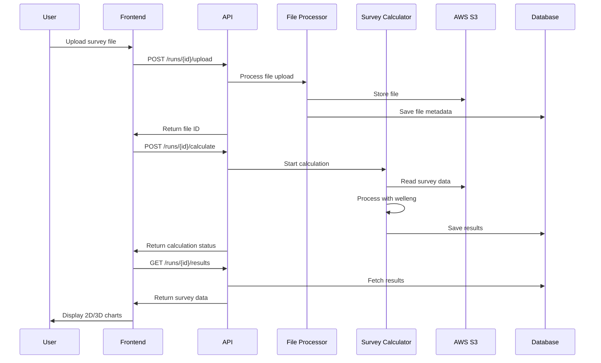

# Core Workflows

### Survey Upload and Calculation Workflow

```mermaid
sequenceDiagram
    participant U as User
    participant F as Frontend
    participant A as API
    participant FP as File Processor
    participant SC as Survey Calculator
    participant S3 as AWS S3
    participant DB as Database
    
    U->>F: Upload survey file
    F->>A: POST /runs/{id}/upload
    A->>FP: Process file upload
    FP->>S3: Store file
    FP->>DB: Save file metadata
    A->>F: Return file ID
    
    F->>A: POST /runs/{id}/calculate
    A->>SC: Start calculation
    SC->>S3: Read survey data
    SC->>SC: Process with welleng
    SC->>DB: Save results
    A->>F: Return calculation status
    
    F->>A: GET /runs/{id}/results
    A->>DB: Fetch results
    A->>F: Return survey data
    F->>U: Display 2D/3D charts
```

