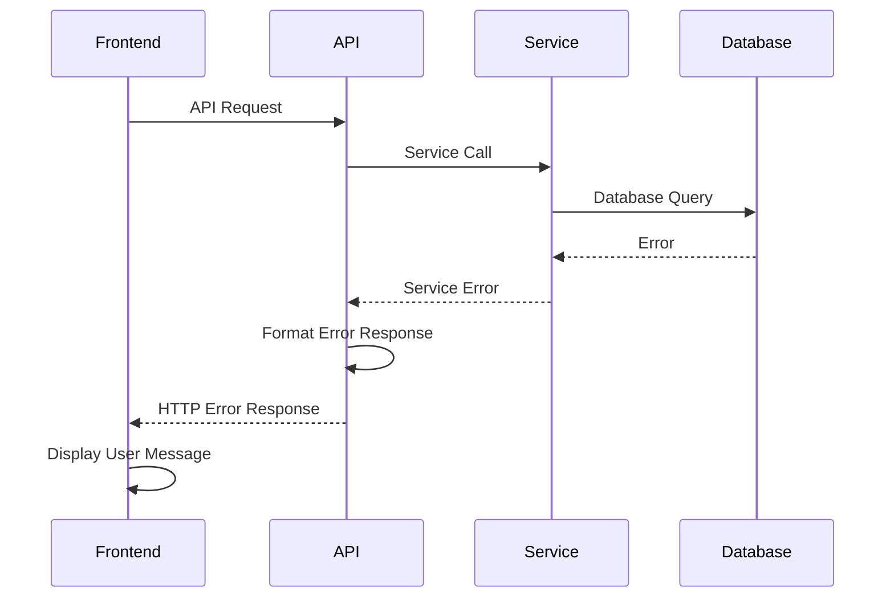

# Error Handling Strategy

### Error Flow


### Error Response Format
```typescript
interface ApiError {
  error: {
    code: string;
    message: string;
    details?: Record<string, any>;
    timestamp: string;
    requestId: string;
  };
}
```

### Frontend Error Handling
```typescript
import { toast } from 'react-toastify';

export const handleApiError = (error: any) => {
  if (error.response?.data?.error) {
    const { code, message } = error.response.data.error;
    toast.error(`${code}: ${message}`);
  } else {
    toast.error('An unexpected error occurred');
  }
};
```

### Backend Error Handling
```python
from rest_framework.views import exception_handler
from rest_framework.response import Response
from rest_framework import status
import logging

def custom_exception_handler(exc, context):
    response = exception_handler(exc, context)
    
    if response is not None:
        custom_response_data = {
            'error': {
                'code': 'VALIDATION_ERROR',
                'message': 'Invalid input data',
                'details': response.data,
                'timestamp': timezone.now().isoformat(),
                'requestId': context['request'].META.get('HTTP_X_REQUEST_ID')
            }
        }
        response.data = custom_response_data
    
    return response
```

