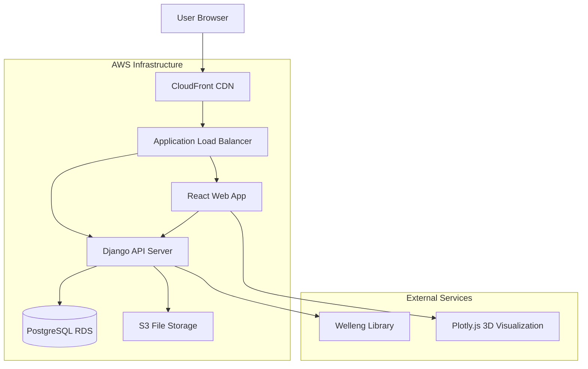

# High Level Architecture

### Technical Summary

The Survey Management System is a modern web application built with Django REST Framework backend and React frontend, designed for managing well survey data with advanced calculations using the welleng library. The system follows a traditional three-tier architecture with PostgreSQL database, deployed on AWS infrastructure. The frontend provides rich 2D/3D visualization capabilities using Plotly.js, while the backend handles complex survey calculations, file processing, and report generation. The architecture emphasizes security, performance, and scalability to support engineering workflows with large datasets.

### Platform and Infrastructure Choice

**Platform:** AWS (Amazon Web Services)
**Key Services:** EC2, RDS PostgreSQL, S3, CloudFront, IAM, CloudWatch
**Deployment Host and Regions:** us-east-1 (primary), us-west-2 (backup)

### Repository Structure

**Structure:** Monorepo with separate frontend and backend applications
**Monorepo Tool:** npm workspaces
**Package Organization:** apps/ (web, api), packages/ (shared, ui, config)

### High Level Architecture Diagram

### Architectural Patterns

- **Traditional Three-Tier Architecture:** Clear separation between presentation, business logic, and data layers - _Rationale:_ Provides clear boundaries and scalability for enterprise applications with complex business logic
- **RESTful API Design:** Standard HTTP methods and status codes for API communication - _Rationale:_ Industry standard approach with excellent tooling and documentation support for scientific computing workflows
- **Component-Based Frontend:** Reusable React components with TypeScript - _Rationale:_ Maintainability and type safety across large codebases with complex visualization requirements
- **Repository Pattern:** Abstract data access logic in backend - _Rationale:_ Enables testing and future database migration flexibility for survey data models
- **File-Based Processing:** Asynchronous file upload and processing workflow - _Rationale:_ Handles large survey files efficiently without blocking user interface during calculations
- **Event-Driven Updates:** Real-time status updates for long-running calculations - _Rationale:_ Provides user feedback during complex welleng library processing operations

