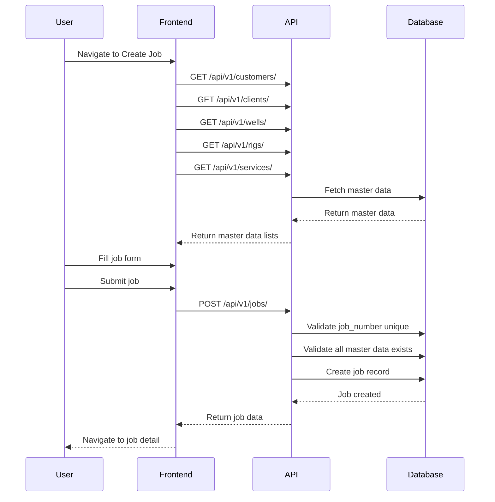
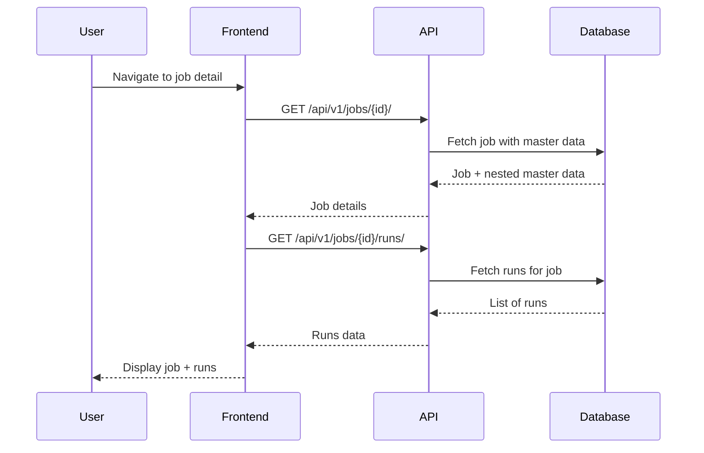
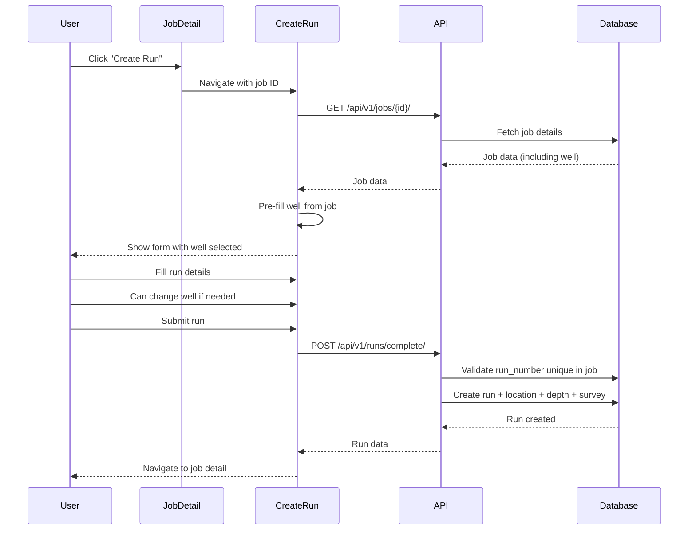
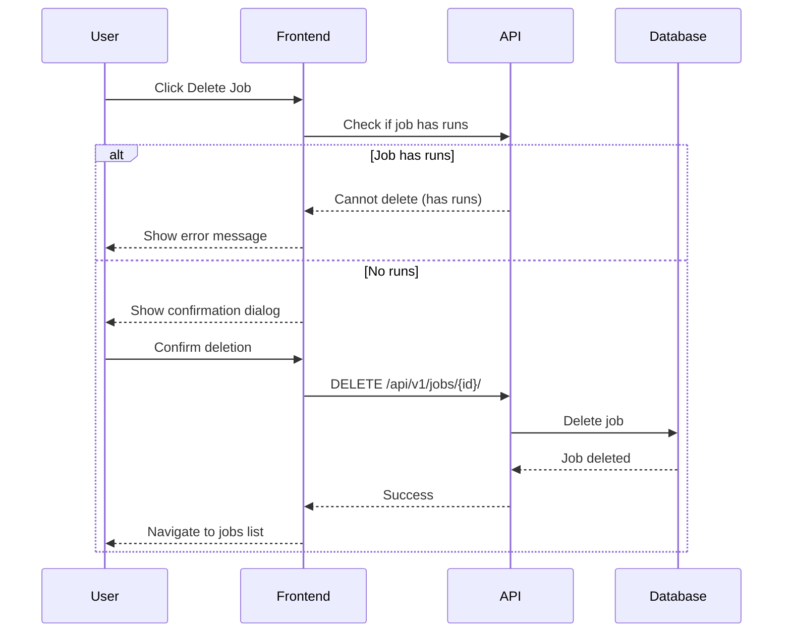

# Job Workflow Documentation

## Table of Contents
1. [Overview](#overview)
2. [Database Structure](#database-structure)
3. [Master Data Models](#master-data-models)
4. [Job Model](#job-model)
5. [Relationships](#relationships)
6. [Job Workflow](#job-workflow)
7. [API Endpoints](#api-endpoints)
8. [Business Rules](#business-rules)
9. [Frontend Implementation](#frontend-implementation)

---

## Overview

The Job system is designed to manage survey jobs that link multiple master data entities (Customer, Client, Well, Rig, Service) with survey runs. A Job represents a specific survey project at a well location for a customer/client, using specific equipment and services.

### Key Concepts
- **Job**: Central entity linking master data and runs
- **Master Data**: Reference data (Customer, Client, Well, Rig, Service)
- **Run**: Individual survey operations within a job
- **One Job, Many Runs**: A job can have multiple runs, but each run belongs to one job

---

## Database Structure

### Entity Relationship Diagram

```
┌─────────────┐
│  Customer   │
│  (Master)   │
└──────┬──────┘
       │
       │ 1:N
       │
┌──────▼──────┐      ┌─────────────┐
│   Client    │      │    Well     │
│  (Master)   │      │  (Master)   │
└──────┬──────┘      └──────┬──────┘
       │                    │
       │ 1:N                │ 1:N
       │                    │
       └────────┬───────────┘
                │
                │
         ┌──────▼──────┐
         │     Job     │◄──────┐
         │  (Central)  │       │ 1:N
         └──────┬──────┘       │
                │              │
         ┌──────┴──────┐   ┌───┴────┐
         │             │   │  Run   │
    ┌────▼────┐   ┌────▼───┤        │
    │   Rig   │   │Service │        │
    │(Master) │   │(Master)│        │
    └─────────┘   └────────┘        │
                                    │
                  ┌─────────────────┘
                  │
         ┌────────▼────────┐
         │   Location      │
         │   Depth         │
         │   TieOn         │
         │   Survey Data   │
         └─────────────────┘
```

---

## Master Data Models

### 1. Customer Model
**Purpose**: Represents the end customer/operator for whom the survey is performed.

**Database Table**: `customers`

**Fields**:
```python
class Customer(models.Model):
    id = UUIDField(primary_key=True, default=uuid.uuid4)
    customer_name = CharField(max_length=255, unique=True)
    customer_code = CharField(max_length=50, unique=True, null=True, blank=True)
    created_at = DateTimeField(auto_now_add=True)
    updated_at = DateTimeField(auto_now=True)
```

**Business Rules**:
- Customer name must be unique
- Customer code is optional but must be unique if provided
- Cannot be deleted if associated with any jobs

**Example**:
```json
{
  "id": "uuid",
  "customer_name": "BP America",
  "customer_code": "BP-001"
}
```

---

### 2. Client Model
**Purpose**: Represents the direct client (often a drilling contractor) working for the customer.

**Database Table**: `clients`

**Fields**:
```python
class Client(models.Model):
    id = UUIDField(primary_key=True, default=uuid.uuid4)
    client_name = CharField(max_length=255, unique=True)
    client_code = CharField(max_length=50, unique=True, null=True, blank=True)
    created_at = DateTimeField(auto_now_add=True)
    updated_at = DateTimeField(auto_now=True)
```

**Business Rules**:
- Client name must be unique
- Client code is optional but must be unique if provided
- Cannot be deleted if associated with any jobs

**Example**:
```json
{
  "id": "uuid",
  "client_name": "Halliburton",
  "client_code": "HAL-001"
}
```

---

### 3. Well Model
**Purpose**: Represents the physical well location where surveys are conducted.

**Database Table**: `wells`

**Fields**:
```python
class Well(models.Model):
    id = UUIDField(primary_key=True, default=uuid.uuid4)
    well_id = CharField(max_length=100)
    well_name = CharField(max_length=255)
    field_name = CharField(max_length=255, null=True, blank=True)
    location = ForeignKey('Location', null=True, blank=True, on_delete=SET_NULL)
    created_at = DateTimeField(auto_now_add=True)
    updated_at = DateTimeField(auto_now=True)
```

**Related**: Location (one-to-one relationship)

**Business Rules**:
- Well ID and name are required
- Field name is optional
- Can have one location with detailed geographic/geodetic data
- Cannot be deleted if associated with any jobs

**Example**:
```json
{
  "id": "uuid",
  "well_id": "BRNW-92",
  "well_name": "Brunswick Well 92",
  "field_name": "Brunswick Field",
  "location": {
    "latitude": 29.5,
    "longitude": -95.2,
    "easting": 500000,
    "northing": 3265000,
    "geodetic_datum": "WGS84",
    "map_zone": "15N"
  }
}
```

---

### 4. Location Model
**Purpose**: Stores detailed geographic and geodetic information for wells.

**Database Table**: `locations`

**Fields**:
```python
class Location(models.Model):
    id = UUIDField(primary_key=True, default=uuid.uuid4)

    # Geographic coordinates (decimal degrees)
    latitude = DecimalField(max_digits=10, decimal_places=7, null=True)
    longitude = DecimalField(max_digits=10, decimal_places=7, null=True)

    # Geographic coordinates (DMS format)
    latitude_degrees = IntegerField(null=True)
    latitude_minutes = IntegerField(null=True)
    latitude_seconds = DecimalField(max_digits=5, decimal_places=2, null=True)
    longitude_degrees = IntegerField(null=True)
    longitude_minutes = IntegerField(null=True)
    longitude_seconds = DecimalField(max_digits=5, decimal_places=2, null=True)

    # Grid coordinates
    easting = DecimalField(max_digits=15, decimal_places=3, null=True)
    northing = DecimalField(max_digits=15, decimal_places=3, null=True)
    north_coordinate = DecimalField(max_digits=15, decimal_places=3, null=True)
    east_coordinate = DecimalField(max_digits=15, decimal_places=3, null=True)

    # Geodetic system
    geodetic_datum = CharField(max_length=50)
    geodetic_system = CharField(max_length=50)
    map_zone = CharField(max_length=20)
    north_reference = CharField(max_length=20, choices=[...])
    central_meridian = DecimalField(max_digits=10, decimal_places=6)
    grid_correction = DecimalField(max_digits=10, decimal_places=6, null=True)

    # Survey parameters
    w_t = DecimalField(max_digits=10, decimal_places=6, null=True)
    min_w_t = DecimalField(max_digits=10, decimal_places=6, null=True)
    max_w_t = DecimalField(max_digits=10, decimal_places=6, null=True)
    g_t = DecimalField(max_digits=10, decimal_places=6, null=True)
    min_g_t = DecimalField(max_digits=10, decimal_places=6, null=True)
    max_g_t = DecimalField(max_digits=10, decimal_places=6, null=True)

    created_at = DateTimeField(auto_now_add=True)
    updated_at = DateTimeField(auto_now=True)
```

**Business Rules**:
- Either decimal OR DMS coordinates must be provided
- Geodetic datum and system are required
- W/T and G/T are optional survey parameters

---

### 5. Rig Model
**Purpose**: Represents the drilling rig used for the job.

**Database Table**: `rigs`

**Fields**:
```python
class Rig(models.Model):
    id = UUIDField(primary_key=True, default=uuid.uuid4)
    rig_number = CharField(max_length=50, unique=True)
    rig_name = CharField(max_length=255)
    rig_type = CharField(max_length=100, null=True, blank=True)
    created_at = DateTimeField(auto_now_add=True)
    updated_at = DateTimeField(auto_now=True)
```

**Business Rules**:
- Rig number must be unique
- Rig name is required
- Rig type is optional (e.g., "Land", "Offshore", "Jack-up")
- Cannot be deleted if associated with any jobs

**Example**:
```json
{
  "id": "uuid",
  "rig_number": "RIG-505",
  "rig_name": "Ocean Explorer",
  "rig_type": "Offshore"
}
```

---

### 6. Service Model
**Purpose**: Represents the type of survey service being performed.

**Database Table**: `services`

**Fields**:
```python
class Service(models.Model):
    id = UUIDField(primary_key=True, default=uuid.uuid4)
    service_name = CharField(max_length=255, unique=True)
    service_code = CharField(max_length=50, unique=True, null=True, blank=True)
    created_at = DateTimeField(auto_now_add=True)
    updated_at = DateTimeField(auto_now=True)
```

**Business Rules**:
- Service name must be unique
- Service code is optional but must be unique if provided
- Cannot be deleted if associated with any jobs

**Example**:
```json
{
  "id": "uuid",
  "service_name": "Directional Drilling Survey",
  "service_code": "DDS-001"
}
```

---

## Job Model

**Purpose**: Central entity that links all master data and serves as the parent for runs.

**Database Table**: `jobs`

**Fields**:
```python
class Job(models.Model):
    id = UUIDField(primary_key=True, default=uuid.uuid4)
    job_number = CharField(max_length=100, unique=True)

    # Master data relationships
    customer = ForeignKey('Customer', on_delete=PROTECT)
    client = ForeignKey('Client', on_delete=PROTECT)
    well = ForeignKey('Well', on_delete=PROTECT)
    rig = ForeignKey('Rig', on_delete=PROTECT)
    service = ForeignKey('Service', on_delete=PROTECT)

    # Optional fields
    description = TextField(null=True, blank=True)
    start_date = DateField(null=True, blank=True)
    end_date = DateField(null=True, blank=True)
    status = CharField(max_length=20, choices=[...], default='planned')

    # Audit fields
    created_by = ForeignKey('User', on_delete=SET_NULL, null=True)
    created_at = DateTimeField(auto_now_add=True)
    updated_at = DateTimeField(auto_now=True)
```

**Status Choices**:
- `planned`: Job is planned but not started
- `active`: Job is currently in progress
- `completed`: Job has been completed
- `on_hold`: Job is temporarily paused
- `cancelled`: Job has been cancelled

**Business Rules**:
1. Job number must be unique across the system
2. All master data relationships (customer, client, well, rig, service) are required
3. Cannot delete master data if referenced by a job (PROTECT constraint)
4. Can only delete a job if it has no associated runs
5. Start date must be before end date if both are provided

**Database Constraints**:
```sql
CONSTRAINT job_number_unique UNIQUE (job_number)
CONSTRAINT check_dates CHECK (end_date >= start_date OR end_date IS NULL)
```

---

## Relationships

### Job to Master Data
**Type**: Many-to-One (Many jobs can reference one master data record)

**On Delete Behavior**: PROTECT
- Prevents deletion of master data if referenced by any job
- Ensures data integrity

**Example**:
```python
# One well can be used by multiple jobs
well = Well.objects.get(well_name="Brunswick 92")
job1 = Job.objects.create(well=well, job_number="JOB-001", ...)
job2 = Job.objects.create(well=well, job_number="JOB-002", ...)

# Attempting to delete well will raise error
well.delete()  # Raises ProtectedError
```

### Job to Run
**Type**: One-to-Many (One job has many runs)

**Relationship**:
```python
class Run(models.Model):
    job = ForeignKey('Job', on_delete=PROTECT, related_name='runs')
    run_number = CharField(max_length=100)
    run_name = CharField(max_length=255)

    class Meta:
        unique_together = [['job', 'run_number'], ['job', 'run_name']]
```

**Business Rules**:
- Run number must be unique within a job (not globally)
- Run name must be unique within a job (not globally)
- Cannot delete a job if it has runs (PROTECT constraint)

**Example**:
```python
job = Job.objects.get(job_number="JOB-001")

# Different jobs can have same run numbers
run1 = Run.objects.create(job=job, run_number="RUN-001", ...)
run2 = Run.objects.create(job=job, run_number="RUN-002", ...)

# Same run number in different job is allowed
other_job = Job.objects.get(job_number="JOB-002")
run3 = Run.objects.create(job=other_job, run_number="RUN-001", ...)  # OK
```

---

## Job Workflow

### 1. Job Creation Flow



**Steps**:
1. User navigates to job creation page
2. Frontend fetches all master data for dropdowns
3. User selects master data and fills job details
4. Frontend validates form
5. Frontend sends POST request to create job
6. Backend validates:
   - Job number is unique
   - All master data references exist
   - Dates are valid (start < end)
7. Job is created in database
8. User is redirected to job detail page

---

### 2. Job Detail View Flow



**Job Detail Page Sections**:

**A. Master Data Section** (Collapsible Accordion)
- Customer information (name, code)
- Client information (name, code)
- Well information:
  - Well ID and name
  - Field name
  - **Location details** (if available):
    - Geographic coordinates (decimal and DMS)
    - Grid coordinates (easting, northing)
    - UTM zone/Map zone
    - Geodetic datum and system
    - North reference and grid correction
    - Central meridian
    - W/T and G/T survey parameters
- Rig information (number, name, type)
- Service information (name, code)
- Job description

**B. Runs Section**
- List of all runs associated with the job
- Run details: number, name, survey type, run type
- Survey files count
- Created date
- Actions: View run details

---

### 3. Create Run from Job Flow



**Key Points**:
1. When creating run from job, the job's well is automatically pre-selected
2. User can change the well if needed (not locked)
3. Run number only needs to be unique within the job
4. All location data from well is available for the run

---

### 4. Job Deletion Flow



**Business Rules**:
- Cannot delete job if it has associated runs
- Delete button is disabled in UI if job has runs
- API returns 400 error if deletion attempted with runs

---

## API Endpoints

### Job Endpoints

#### 1. List Jobs
```http
GET /api/v1/jobs/
```

**Query Parameters**:
- `page`: Page number (default: 1)
- `page_size`: Items per page (default: 10)
- `search`: Search in job_number, customer name, client name
- `ordering`: Sort field (e.g., `-created_at`, `job_number`)
- `status`: Filter by status

**Response**:
```json
{
  "count": 50,
  "next": "http://api/jobs/?page=2",
  "previous": null,
  "results": [
    {
      "id": "uuid",
      "job_number": "JOB-001",
      "customer": {
        "id": "uuid",
        "customer_name": "BP America",
        "customer_code": "BP-001"
      },
      "client": {
        "id": "uuid",
        "client_name": "Halliburton",
        "client_code": "HAL-001"
      },
      "well": {
        "id": "uuid",
        "well_id": "BRNW-92",
        "well_name": "Brunswick Well 92"
      },
      "rig": {
        "id": "uuid",
        "rig_number": "RIG-505",
        "rig_name": "Ocean Explorer"
      },
      "service": {
        "id": "uuid",
        "service_name": "Directional Drilling Survey"
      },
      "status": "active",
      "run_count": 5,
      "created_at": "2025-01-15T10:30:00Z"
    }
  ]
}
```

---

#### 2. Get Job Detail
```http
GET /api/v1/jobs/{id}/
```

**Response**:
```json
{
  "id": "uuid",
  "job_number": "JOB-001",
  "customer": {
    "id": "uuid",
    "customer_name": "BP America",
    "customer_code": "BP-001"
  },
  "client": {
    "id": "uuid",
    "client_name": "Halliburton",
    "client_code": "HAL-001"
  },
  "well": {
    "id": "uuid",
    "well_id": "BRNW-92",
    "well_name": "Brunswick Well 92",
    "field_name": "Brunswick Field",
    "location": {
      "latitude": 29.5,
      "longitude": -95.2,
      "easting": 500000,
      "northing": 3265000,
      "geodetic_datum": "WGS84",
      "geodetic_system": "UTM",
      "map_zone": "15N",
      "north_reference": "True North",
      "central_meridian": -93.0,
      "grid_correction": 1.5,
      "w_t": 0.95,
      "g_t": 1.02
    }
  },
  "rig": {
    "id": "uuid",
    "rig_number": "RIG-505",
    "rig_name": "Ocean Explorer",
    "rig_type": "Offshore"
  },
  "service": {
    "id": "uuid",
    "service_name": "Directional Drilling Survey",
    "service_code": "DDS-001"
  },
  "description": "Directional survey for new well",
  "start_date": "2025-01-15",
  "end_date": "2025-02-15",
  "status": "active",
  "run_count": 5,
  "created_by": {
    "id": "uuid",
    "username": "john.doe",
    "full_name": "John Doe"
  },
  "created_at": "2025-01-15T10:30:00Z",
  "updated_at": "2025-01-16T14:20:00Z"
}
```

---

#### 3. Create Job
```http
POST /api/v1/jobs/
```

**Request Body**:
```json
{
  "job_number": "JOB-001",
  "customer": "customer-uuid",
  "client": "client-uuid",
  "well": "well-uuid",
  "rig": "rig-uuid",
  "service": "service-uuid",
  "description": "Directional survey for new well",
  "start_date": "2025-01-15",
  "end_date": "2025-02-15",
  "status": "planned"
}
```

**Validation**:
- `job_number`: Required, unique
- `customer`, `client`, `well`, `rig`, `service`: Required, must be valid UUIDs
- `start_date`, `end_date`: Optional, end_date must be >= start_date
- `status`: Optional, must be one of the valid choices

**Response**: 201 Created with job object

---

#### 4. Update Job
```http
PUT /api/v1/jobs/{id}/
PATCH /api/v1/jobs/{id}/
```

**Request Body**: Same as create (PUT requires all fields, PATCH allows partial)

**Response**: 200 OK with updated job object

---

#### 5. Delete Job
```http
DELETE /api/v1/jobs/{id}/
```

**Business Rules**:
- Cannot delete if job has runs
- Returns 400 Bad Request if runs exist

**Response**: 204 No Content (on success)

---

#### 6. Get Job Runs
```http
GET /api/v1/jobs/{id}/runs/
```

**Response**:
```json
{
  "count": 5,
  "next": null,
  "previous": null,
  "results": [
    {
      "id": "uuid",
      "run_number": "RUN-001",
      "run_name": "Initial Survey",
      "survey_type": "gyro",
      "run_type": "GTL",
      "survey_files_count": 2,
      "job": {
        "id": "uuid",
        "job_number": "JOB-001"
      },
      "created_at": "2025-01-16T08:00:00Z"
    }
  ]
}
```

---

## Business Rules

### 1. Job Number Uniqueness
- **Rule**: Job numbers must be globally unique
- **Validation**: Checked at database level with unique constraint
- **Error**: "Job with this job number already exists"

### 2. Master Data Protection
- **Rule**: Cannot delete master data (Customer, Client, Well, Rig, Service) if referenced by any job
- **Implementation**: Foreign key with `on_delete=PROTECT`
- **Error**: "Cannot delete [entity] because it is referenced by existing jobs"

### 3. Job-Run Relationship
- **Rule**: Cannot delete job if it has associated runs
- **Implementation**: Custom validation in delete view
- **UI**: Delete button disabled if job has runs
- **Error**: "Cannot delete job with existing runs"

### 4. Run Number Uniqueness Scope
- **Rule**: Run numbers must be unique within a job (not globally)
- **Implementation**: Database unique constraint on (job, run_number)
- **Example**: JOB-001 can have RUN-001 and JOB-002 can also have RUN-001

### 5. Date Validation
- **Rule**: End date must be >= start date if both are provided
- **Implementation**: Database check constraint
- **Error**: "End date must be after or equal to start date"

### 6. Well Pre-selection in Run Creation
- **Rule**: When creating run from job, well is pre-selected from job
- **Implementation**: Job well ID passed in URL, fetched and pre-filled
- **User Choice**: User can change the well if needed (not locked)

### 7. Status Transitions
- **Valid Status Values**: planned, active, completed, on_hold, cancelled
- **Default**: New jobs start as "planned"
- **Note**: No enforced state machine (any status can transition to any other)

---

## Frontend Implementation

### Job List Page
**File**: `apps/web/src/pages/jobs/JobListPage.tsx`

**Features**:
- Paginated list of jobs
- Search by job number, customer, client
- Filter by status
- Sort by various fields
- Displays: job number, customer, client, well, rig, run count, status
- Actions: View, Edit, Delete (disabled if has runs)
- Responsive table (hides columns on mobile)

**Key Components**:
- Uses RTK Query for data fetching
- Real-time updates via cache invalidation
- Optimistic UI updates

---

### Job Detail Page
**File**: `apps/web/src/pages/jobs/JobDetailPage.tsx`

**Features**:
1. **Page Header**
   - Job number as title
   - Breadcrumbs: Home > Jobs > [Job Number]
   - Actions: Edit, Delete

2. **Master Data Section** (Collapsible Accordion)
   - Expanded by default
   - Click to collapse/expand
   - Displays:
     - Customer (name, code)
     - Client (name, code)
     - Well (ID, name, field)
       - **Location details box** (if available):
         - Geographic coordinates (decimal + DMS)
         - Grid coordinates (easting, northing, north, east)
         - Map zone
         - Geodetic datum and system
         - North reference
         - Grid correction and central meridian
         - W/T and G/T parameters with min/max ranges
     - Rig (number, name, type)
     - Service (name, code)
     - Job description

3. **Runs Section** (Paper)
   - Header with run count
   - "Create Run" button
   - Responsive table:
     - Desktop: All columns (run number, name, survey type, run type, files, created date)
     - Tablet: Hides run type and files columns
     - Mobile: Only run number, name, actions; shows survey type and date below main text
   - Actions: View run details

**State Management**:
```typescript
// Accordion state
const [masterDataExpanded, setMasterDataExpanded] = useState(true);

// Fetch job and runs
const { data: job, isLoading, error } = useGetJobByIdQuery(id);
const { data: runs } = useGetJobRunsQuery(id);
```

**Responsive Design**:
- Grid system adapts to screen size
- Table columns hide on smaller screens
- Important info shown in condensed format on mobile

---

### Job Create Page
**File**: `apps/web/src/pages/jobs/JobCreatePage.tsx`

**Features**:
- Form with all required fields
- Dropdowns for all master data
- Auto-complete/search for large lists
- Date pickers for start/end dates
- Text area for description
- Status selector
- Form validation:
  - Required fields
  - Date range validation
  - Unique job number check

**Form Flow**:
1. Load master data for dropdowns
2. User fills form
3. Client-side validation
4. Submit to API
5. On success: Navigate to job detail page
6. On error: Show validation errors

---

### Create Run from Job
**File**: `apps/web/src/pages/runs/CreateCompleteRunPage.tsx`

**Job Integration**:
```typescript
// Get job ID from URL
const jobIdFromUrl = searchParams.get('job');

// Fetch job data to get well
useEffect(() => {
  if (jobIdFromUrl) {
    const job = await jobsService.getJobById(jobIdFromUrl);
    setJobWellId(job.well?.id);
  }
}, [jobIdFromUrl]);

// Pre-fill form
const formInitialData = {
  run: {
    job: jobIdFromUrl,
    well: jobWellId,
  }
};
```

**Well Selection**:
- Well dropdown is pre-populated with job's well
- User can see the well name immediately
- User can change to different well if needed
- All wells are available in dropdown

**Back Navigation**:
- "Back to Job" button
- Uses `window.location.href` for reliable navigation
- Returns to job detail page

---

## Data Flow Examples

### Example 1: Creating a Complete Job Workflow

**Step 1: Create Master Data**
```bash
# Create Customer
POST /api/v1/customers/
{
  "customer_name": "BP America",
  "customer_code": "BP-001"
}

# Create Client
POST /api/v1/clients/
{
  "client_name": "Halliburton",
  "client_code": "HAL-001"
}

# Create Well with Location
POST /api/v1/wells/create_with_location/
{
  "well_id": "BRNW-92",
  "well_name": "Brunswick Well 92",
  "location": {
    "latitude": 29.5,
    "longitude": -95.2,
    "geodetic_datum": "WGS84",
    "geodetic_system": "UTM",
    "map_zone": "15N",
    "north_reference": "True North",
    "central_meridian": -93.0
  }
}

# Create Rig
POST /api/v1/rigs/
{
  "rig_number": "RIG-505",
  "rig_name": "Ocean Explorer",
  "rig_type": "Offshore"
}

# Create Service
POST /api/v1/services/
{
  "service_name": "Directional Drilling Survey",
  "service_code": "DDS-001"
}
```

**Step 2: Create Job**
```bash
POST /api/v1/jobs/
{
  "job_number": "JOB-001",
  "customer": "customer-uuid",
  "client": "client-uuid",
  "well": "well-uuid",
  "rig": "rig-uuid",
  "service": "service-uuid",
  "description": "Directional survey for new well",
  "start_date": "2025-01-15",
  "status": "planned"
}
```

**Step 3: Create Runs**
```bash
# Run 1
POST /api/v1/runs/complete/
{
  "run": {
    "job": "job-uuid",
    "run_number": "RUN-001",
    "run_name": "Initial Survey",
    "well": "well-uuid",
    "survey_type": "gyro"
  },
  "location": {...},
  "depth": {...},
  "survey": {...}
}

# Run 2
POST /api/v1/runs/complete/
{
  "run": {
    "job": "job-uuid",
    "run_number": "RUN-002",
    "run_name": "Follow-up Survey",
    "well": "well-uuid",
    "survey_type": "gyro"
  },
  "location": {...},
  "depth": {...},
  "survey": {...}
}
```

---

### Example 2: Job Detail Data Flow

**Request**: `GET /api/v1/jobs/{id}/`

**Database Queries**:
```sql
-- Single query with select_related
SELECT jobs.*,
       customers.*,
       clients.*,
       wells.*,
       locations.*,
       rigs.*,
       services.*,
       users.*
FROM jobs
LEFT JOIN customers ON jobs.customer_id = customers.id
LEFT JOIN clients ON jobs.client_id = clients.id
LEFT JOIN wells ON jobs.well_id = wells.id
LEFT JOIN locations ON wells.location_id = locations.id
LEFT JOIN rigs ON jobs.rig_id = rigs.id
LEFT JOIN services ON jobs.service_id = services.id
LEFT JOIN users ON jobs.created_by_id = users.id
WHERE jobs.id = 'job-uuid';
```

**Performance**: 1 query instead of 7 separate queries (optimized with select_related)

---

## Summary

The Job system provides:

1. **Centralized Job Management**
   - Links all master data in one place
   - Serves as parent for multiple runs
   - Maintains data integrity with PROTECT constraints

2. **Flexible Master Data**
   - Reusable across multiple jobs
   - Protected from accidental deletion
   - Rich location data for wells

3. **Job-Run Hierarchy**
   - One job → many runs
   - Run numbers unique per job
   - Seamless run creation from job

4. **Complete Location Information**
   - Geographic coordinates (decimal and DMS)
   - Grid coordinates (UTM)
   - Geodetic system details
   - Survey parameters (W/T, G/T)

5. **User-Friendly Interface**
   - Collapsible sections for better UX
   - Pre-filled data from parent entities
   - Responsive design for all devices
   - Real-time updates and validation

6. **Data Integrity**
   - Unique constraints
   - Foreign key protections
   - Validation at multiple levels
   - Audit trail (created_by, timestamps)

This architecture ensures reliable job management for survey operations while maintaining flexibility and data integrity.
